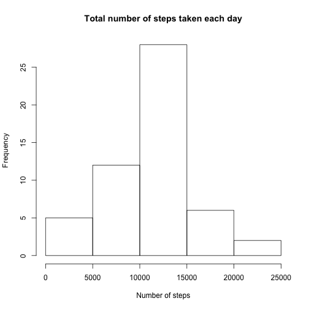
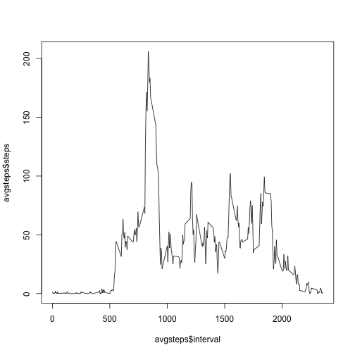
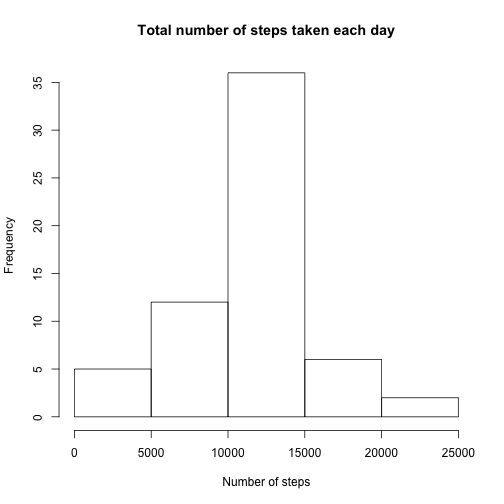
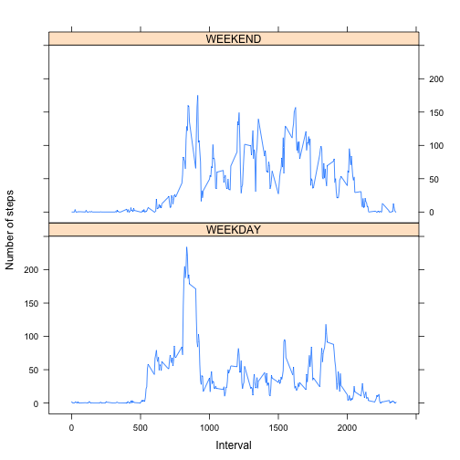

## Loading and preprocessing the data

```r
  library(data.table)
  library(dplyr)
```

```r
  if(!file.exists("activity.csv")){ unzip("activity.zip") }
  dt <- fread('activity.csv')

  # convert date columns to an actual date
  datetime <- paste(dt$date, sprintf("%04s", dt$interval))
  dt <- dt[,datetime := as.POSIXct(strptime(datetime, "%Y-%m-%d %H%M"))]
```

## What is mean total number of steps taken per day?
1. Calculate the total number of steps taken per day

```r
  stepsbydate <- dt[,lapply(.SD,sum),by="date",.SDcols=c("steps")]
```
2. Make a histogram of the total number of steps taken each day

```r
  hist(stepsbydate$steps, main="Total number of steps taken each day", xlab="Number of steps") 
```

 

3. Calculate and report the mean and median of the total number of steps taken per day

```r
  mean(stepsbydate$steps, na.rm=T)
```

```
## [1] 10766.19
```

```r
  median(stepsbydate$steps, na.rm=T)
```

```
## [1] 10765
```

## What is the average daily activity pattern?
1. Make a time series plot (i.e. type = "l") of the 5-minute interval (x-axis) and the average number of steps taken, averaged across all days (y-axis)

```r
  avgsteps <- aggregate(list(steps=dt$steps), list(interval=dt$interval), mean, na.rm=T)
  plot(avgsteps$interval, avgsteps$steps, type="l")
```

 

2. Which 5-minute interval, on average across all the days in the dataset, contains the maximum number of steps?

```r
  maxsteps <- max(avgsteps$steps)
  avgsteps[avgsteps$steps == maxsteps,]$interval
```

```
## [1] 835
```

## Imputing missing values
Note that there are a number of days/intervals where there are missing values (coded as NA). The presence of missing days may introduce bias into some calculations or summaries of the data.

1. Calculate and report the total number of missing values in the dataset (i.e. the total number of rows with NAs)

```r
  sum(is.na(dt$steps))
```

```
## [1] 2304
```

2. Devise a strategy for filling in all of the missing values in the dataset:
``` The chosen imputing strategy is to fill in NA values with the mean for the corresponding 5-minute interval ```

```r
  filled <- dt
  for(i in 1:nrow(filled)){
    if(is.na(filled[[i,1]])){
      filled[[i,1]] <- avgsteps[avgsteps$interval==filled[[i,3]],]$steps
    }
  }
```

3. Make a histogram of the total number of steps taken each day and Calculate and report the mean and median total number of steps taken per day.

```r
  filledstepsbydate <- filled[,lapply(.SD,sum),by="date",.SDcols=c("steps")]
  hist(filledstepsbydate$steps, main="Total number of steps taken each day", xlab="Number of steps") 
```

 

```r
  mean(filledstepsbydate$steps, na.rm=T)
```

```
## [1] 10766.19
```

```r
  median(filledstepsbydate$steps, na.rm=T)
```

```
## [1] 10766.19
```
  1. Do these values differ from the estimates from the first part of the assignment?
    * The mean remains the same, because we used the mean to fill-in the missing values.  The median changes slightly, because there were now more datapoints to calculate (since we were omitting NA before, and now we have filled those NAs with a single value (the mean from that interval).
  2. What is the impact of imputing missing data on the estimates of the total daily number of steps?
    * This artificially inflates the total daily number of steps because every unrecorded (NA) value has been replaced by the mean of that interval.

## Are there differences in activity patterns between weekdays and weekends?

1. Create a new factor variable in the dataset with two levels – “weekday” and “weekend” indicating whether a given date is a weekday or weekend day.

```r
  # add the day of week as a new column
  dt <- dt[,dayofweek := as.factor(toupper(strftime(dt$datetime, format="%a")))]

  # create a helper function to classify as weekend or weekday
  dayclassifier <- function(x){ if( x == "SAT" | x == "SUN" ) { as.factor("WEEKEND") } else { as.factor("WEEKDAY") } }
  dt <- dt[,typeofday := sapply(dt$dayofweek, dayclassifier)]
```

2. Make a panel plot containing a time series plot (i.e. type = "l") of the 5-minute interval (x-axis) and the average number of steps taken, averaged across all weekday days or weekend days (y-axis).

```r
  library(lattice)
  msteps <- aggregate(list(steps=dt$steps), list(interval=dt$interval,typeofday=dt$typeofday),  mean, na.rm=T)
  xyplot(steps ~ interval | typeofday, data = msteps, type="l", xlab="Interval", ylab="Number of steps", layout=c(1,2))
```

 
